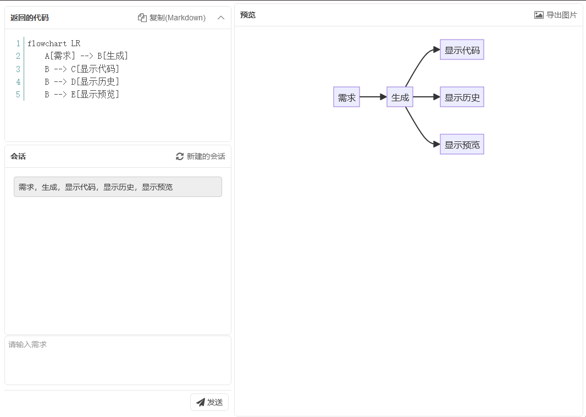

# 1. 介绍

输入需求，调用GPTAPI生成`mermaid`格式的流程图；

这里只作为工具，生成流程图，主要为了加入到公司的项目管理运维管理，二开可以套数据库、接口等。所以功能有限，可以作为工具或代码示例。

在线体验

https://mermaid.shizhuoran.top/

使用的是 GPT_API_free gpt-3.5-turbo模型，可能不稳定，每天100次


# 2. 技术栈

环境|说明
-|-
`.Net8.0` | 后端
[FineUI11](https://fineui.com/fans/)|前端 + 后端
`marked.min.js`|显示`markdown`
`highlightjs-line-numbers.min.js`|显示 行号
`mermaid.min.js`|显示流程图
`pako.min.js`<br/>`base64.min.js`|压缩加密
`https://mermaid.ink/img` | 导出图片

gpt返回`markdown`格式的代码；使用`marked.min.js`显示；`highlightjs`控制行号格式；同时触发`marked.renderer`，最后回调 `mermaid.render`；


# 3. 配置

[GPTAPI](https://gitcode.com/chatanywhere/GPT_API_free/overview?tab=readme-ov-file&utm_source=csdn_github_accelerator&isLogin=1)配置 `helpconfig.json` 文件，注意不要有注释

[GPT_API_free](https://gitcode.com/chatanywhere/GPT_API_free/overview?tab=readme-ov-file&utm_source=csdn_github_accelerator&isLogin=1) 提供的免费API，目前支持`gpt-4o`、`gpt-3.5-turbo`、`gpt-3.5-turbo-16k`

```
{
  "model": "gpt-4o",//模型
  "url": "https://api.chatanywhere.tech/v1/chat/completions",//代理地址
  "key": ""//APIKEY
}
```

***
`MermaidMask.cs` 角色面具，目前写死了`flowchart LR`

## 3.1 Docker部署

docker-compose.yml

```
services:
  mermaidhelp:
    restart: unless-stopped
    image: 935732994/mermaidhelp
    #注意80是内部端口
    ports:
      - 8001:80
    #这里填写API配置
    environment:
      - MODEL=gpt-4o
      - URL=
      - KEY=
```
## 3.2 本地编译

需要安装 .net8 环境，我的使用的VS2022开发；

可以在根目录下打包：
```
docker build -t mermaidhelp .
```

---
# 4. 后续

- ~~Mermaid格式，目前写死了`flowchart LR`~~ | 2024年6月3日
- ~~历史的视图~~ | 2024年6月3日
- ~~全屏显示~~ | 2024年5月30日
- ~~显示错误信息~~ | 2024年5月30日
- ~~关联到 https://mermaid.live/~~ | 2024年5月30日
- ~~增加代码可读性~~  |  2024年5月30日
- ~~Docker 支持~~ |  2024年5月30日

# 5. 图片



# 6. 链接

[FineUI11](https://fineui.com/fans/)

[GPT_API_free](https://gitcode.com/chatanywhere/GPT_API_free/overview?tab=readme-ov-file&utm_source=csdn_github_accelerator&isLogin=1)

# 7. 结善缘

 

 
